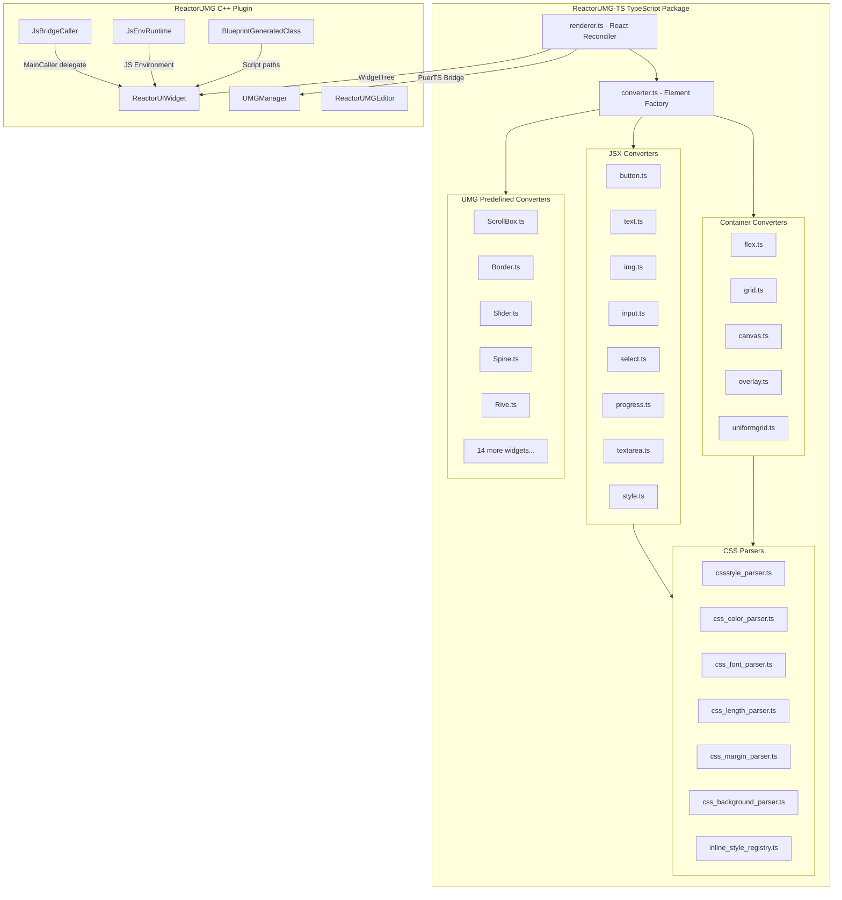

# ReactorUMG: Alpha to Production-Grade React Renderer

## Current State Assessment

Two codebases:
- **C++ Plugin** ([`L:\Dev\ReactorUMG`](L:\Dev\ReactorUMG)) -- Unreal Engine plugin with PuerTS integration, widget management, asset loading, editor tooling
- **TypeScript Package** ([`L:\Dev\ReactorUMG-TS`](L:\Dev\ReactorUMG-TS)) -- React reconciler, element converters (container/JSX/UMG), CSS parsers, comprehensive test suite

## Critical Bugs Found

1. **[`parsers/common_props_parser.ts`](L:\Dev\ReactorUMG-TS\parsers\common_props_parser.ts) line 401-408** -- `parseVisibility` hitTest `switch` is missing `break` statements; all cases fall through to `default: Visible`
2. **Margin constructor** argument ordering inconsistency in several files (UE expects `Left, Top, Right, Bottom`)
3. **Win64-only restriction** on ReactorUMG module in [`ReactorUMG.uplugin`](L:\Dev\ReactorUMG\ReactorUMG.uplugin)

## Phase 1: Foundation Fixes and Package Setup

Fix critical bugs, wire up the local fork instead of npm, and establish a solid base.

| Task | File(s) |
|------|---------|
| Fix `parseVisibility` switch fallthrough | [`parsers/common_props_parser.ts`](L:\Dev\ReactorUMG-TS\parsers\common_props_parser.ts) |
| Audit and fix Margin constructor argument ordering | Multiple converter files |
| Update [`Scripts/Project/package.json`](L:\Dev\ReactorUMG\Scripts\Project\package.json) to reference local `ReactorUMG-TS` via `file:` or git URL | `package.json` |
| Add `insertBefore` to reconciler host config (required for list reordering) | [`renderer.ts`](L:\Dev\ReactorUMG-TS\renderer.ts) |
| Add proper widget cleanup/disposal in reconciler `removeChild` flows | [`renderer.ts`](L:\Dev\ReactorUMG-TS\renderer.ts), [`converter.ts`](L:\Dev\ReactorUMG-TS\converter.ts) |

## Phase 2: Missing Component Implementations

Components declared in [`index.d.ts`](L:\Dev\ReactorUMG-TS\index.d.ts) but not implemented.

| Component | Status | Work Needed |
|-----------|--------|-------------|
| **ListView** | Declared, no impl | Full virtualized list implementation via `UListView` |
| **TreeView** | Declared, no impl | Full tree implementation via `UTreeView` |
| **TileView** | Declared, no impl | Full tile grid implementation via `UTileView` |
| `<input type="checkbox">` | Not mapped | Map to JSX CheckBox via input converter |
| `<input type="radio">` | Not mapped | Map to CheckBox group with radio behavior |
| `<a>` tag | In text containers set, no converter | Implement as clickable text with URL opening |
| `<label>` tag | In JSX keywords, no converter | Map to TextBlock with `for` attribute support |
| `<video>` / `<audio>` | In JSX keywords, no converter | Media widget integration or stub |

## Phase 3: CSS and Layout Completion

| Feature | Current State | Implementation Approach |
|---------|---------------|------------------------|
| CSS `transition` / `animation` | Not supported | Timer-driven property interpolation system |
| `border` / `border-radius` shorthand | Not mapped | Parse to SlateBrush outline settings |
| `box-shadow` | Not supported | Map to SlateBrush or overlay approach |
| `overflow: scroll/auto` | Not auto-mapped | Auto-wrap in ScrollBox when detected |
| CSS variables `var()` | Not supported | Variable registry with cascading resolution |
| `@media` queries in `<style>` | Not parsed | Viewport-size-based conditional style application |
| `position: absolute/relative/fixed` | Only Canvas | Map `absolute` to CanvasPanel slot, `relative` to Overlay |
| `z-index` in non-Canvas | Not supported | Sort children by z-index before appending |
| `flexWrap` | Partial | Map to WrapBox when `flex-wrap: wrap` detected |

## Phase 4: Event System and Interactivity

Build a proper event system with bubbling/capturing semantics.

| Feature | Implementation |
|---------|----------------|
| Event bubbling/capturing | Event dispatcher that walks the widget tree |
| Focus management | Focus navigation system between React components |
| Keyboard event routing | Map UMG keyboard events to React `onKeyDown`/`onKeyUp` |
| Mouse event routing | Map UMG mouse events to React `onClick`/`onMouseEnter`/etc. |
| Gamepad/touch input | Map controller input to React events |
| Drag-and-drop | UMG DragDropOperation integration |

## Phase 5: C++ Backend Improvements

| Task | File(s) |
|------|---------|
| Make SpinePlugin dependency optional (conditional compile) | [`ReactorUMG.Build.cs`](L:\Dev\ReactorUMG\Source\ReactorUMG\ReactorUMG.Build.cs), [`UMGManager.h`](L:\Dev\ReactorUMG\Source\ReactorUMG\Public\UMGManager.h) |
| Extend PlatformAllowList beyond Win64 | [`ReactorUMG.uplugin`](L:\Dev\ReactorUMG\ReactorUMG.uplugin) |
| Add proper C++ cleanup in `BeginDestroy` (clear JS bridge callers) | [`ReactorUIWidget.cpp`](L:\Dev\ReactorUMG\Source\ReactorUMG\Private\ReactorUIWidget.cpp) |
| Add tick/update mechanism for per-frame React state updates | [`ReactorUIWidget.h/cpp`](L:\Dev\ReactorUMG\Source\ReactorUMG\Classes\ReactorUIWidget.h) |
| Add hot-reload support for development iteration | [`JsEnvRuntime.h/cpp`](L:\Dev\ReactorUMG\Source\ReactorUMG\Public\JsEnvRuntime.h) |
| Batched `SynchronizeWidgetProperties` calls | [`UMGManager.cpp`](L:\Dev\ReactorUMG\Source\ReactorUMG\Private\UMGManager.cpp) |
| Add Doxygen documentation to all C++ headers | All `.h` files in `Source/ReactorUMG/` |

## Phase 6: Performance Optimizations

| Optimization | Approach |
|-------------|----------|
| Widget pooling/recycling | Maintain a pool of pre-created widgets per type |
| Batched property updates | Queue property changes during reconciliation, flush once |
| Dirty-flag rendering | Only call `SynchronizeProperties` on actually changed widgets |
| Lazy child slot creation | Defer slot setup until widget is visible |

## Execution Order

We execute strictly in phase order. Each phase is a complete, testable milestone. Phase 1 is the immediate priority as it unblocks everything else and fixes shipped bugs.
